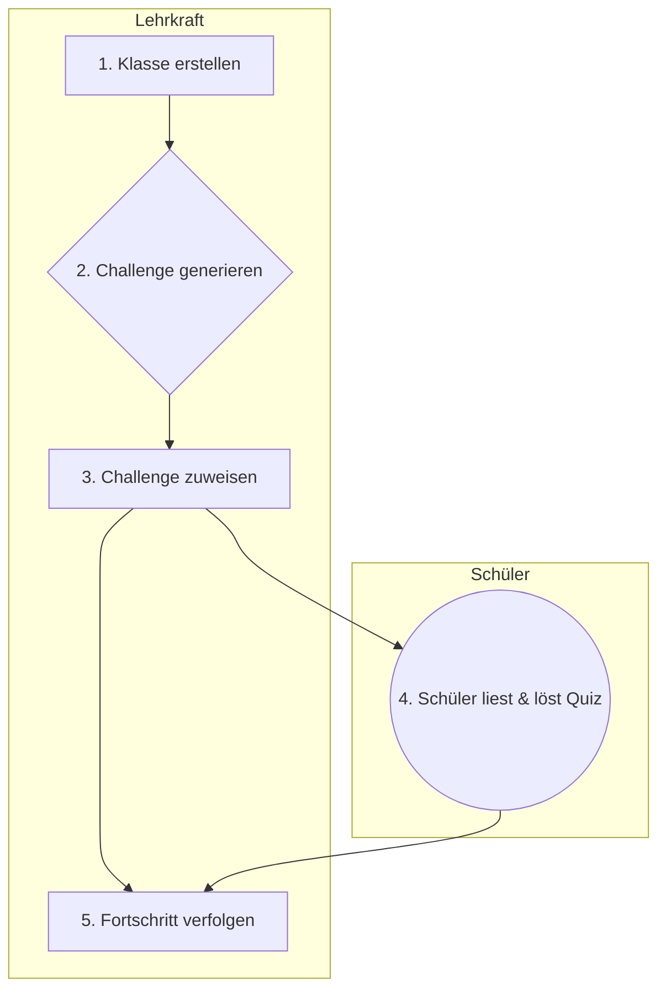

<!-- _class: lead -->

# **LinguaLeap**

## Die Zukunft des Lesens.
### KI-gestützt, spielerisch und motivierend.

---

# **Die Herausforderung**

## Lesemotivation im digitalen Zeitalter

Als Lehrkraft wissen Sie:
- Die Aufmerksamkeitsspanne der Schüler ist kurz.
- Es ist schwierig, für jeden Schüler passende und motivierende Leseinhalte zu finden.
- Die individuelle Förderung und Fortschrittskontrolle kostet viel Zeit.

---

<!-- _class: invert -->

# **Unsere Lösung: LinguaLeap**

Eine interaktive Lese-App, die klassische Literatur mit künstlicher Intelligenz und spielerischen Elementen verbindet, um das Lesen für Kinder zu einem Abenteuer zu machen.

---

# **Was ist LinguaLeap?**

LinguaLeap ist eine Plattform, auf der Sie als Lehrkraft...
1.  **KI-gestützte Lese-Challenges** aus Tausenden von gemeinfreien Büchern (z.B. von Project Gutenberg) erstellen.
2.  Diese Challenges an Ihre **Schulklassen** zuweisen.
3.  Den Lernfortschritt in einer **spielerischen Umgebung** mit Punkten und Ranglisten verfolgen.

**Das Ziel:** Lesekompetenz und -freude nachhaltig steigern.

---

# **So einfach funktioniert's**

### Für Lehrkräfte

1.  **Klasse erstellen**
    Erstellen Sie virtuelle Klassen für Ihre Schüler und verwalten Sie Mitglieder.

2.  **Challenge generieren**
    Lassen Sie die KI in Sekunden eine Lese-Challenge zu einem Thema Ihrer Wahl erstellen.

3.  **Fortschritt verfolgen**
    Analysieren Sie die Lese-Entwicklung Ihrer Schüler über detaillierte Dashboards.

---

# **1. Einfache Klassenverwaltung**

- **Schnelles Einrichten:** Erstellen Sie Klassen mit wenigen Klicks.
- **Sprachauswahl:** Legen Sie die Unterrichtssprache (Deutsch/Englisch) pro Klasse fest.
- **Altersstufen:** Definieren Sie eine Altersgruppe (5-12 Jahre) für passende Inhalte.
- **Einfache Schülerverwaltung:** Fügen Sie Schüler einfach per E-Mail hinzu.

---

# **2. KI-gestützte Lese-Challenges**

### Ihre Ideen, von der KI umgesetzt.

- **Themenbasiert:** Geben Sie ein Thema vor (z.B. "Dinosaurier", "Märchen").
- **Individuelle Schwierigkeit:** Wählen Sie zwischen Anfänger, Mittelstufe und Fortgeschritten.
- **Automatische Inhaltserstellung:** Die KI wählt passende Textabschnitte aus klassischer Literatur und erstellt dazu Verständnistests (Multiple-Choice).
- **Sicher & Altersgerecht:** Alle Inhalte sind für Kinder gefiltert und pädagogisch wertvoll.

---

# **3. Detaillierte Fortschrittsanalyse**

### Behalten Sie den Überblick.

- **Klassen-Ranglisten:** Fördern Sie gesunden Wettbewerb.
- **Lesegeschwindigkeit:** Sehen Sie, wie schnell Ihre Schüler lesen (Wörter pro Minute).
- **Leseverständnis:** Analysieren Sie die Erfolgsquote bei den Quizfragen.
- **Individuelle Berichte:** Verfolgen Sie die Entwicklung jedes einzelnen Schülers.

---

# **Die Schüler-Erfahrung**

### Spielerisches Lernen

- **Interaktive Challenges:** Schüler lesen Abschnitte und beantworten direkt Fragen.
- **Punkte sammeln:** Für gelesene Texte und richtige Antworten gibt es Punkte.
- **Ranglisten:** Schüler sehen ihren Platz in der Klasse und werden motiviert.
- **Eigenes Tempo:** Jeder Schüler arbeitet in seiner eigenen Geschwindigkeit.

---

# **Die Vorteile auf einen Blick**

**Für Sie als Lehrkraft:**
- **Zeitersparnis:** Automatisierte Erstellung von Lehrmaterial.
- **Differenzierung:** Einfache Zuweisung von Aufgaben unterschiedlicher Schwierigkeitsgrade.
- **Transparenz:** Klare Einblicke in die Leistung jedes Schülers.

**Für Ihre Schüler:**
- **Motivation:** Spaß am Lesen durch Wettbewerb und Belohnungen.
- **Selbstvertrauen:** Erfolgserlebnisse durch schaffbare Aufgaben.
- **Kompetenz:** Nachweisliche Verbesserung der Lese- und Verständnisfähigkeiten.

---

<!-- _class: invert -->

# **Zweisprachige Förderung**
## Deutsch & Englisch

LinguaLeap ist vollständig bilingual.
- Die **Benutzeroberfläche** ist komplett auf Deutsch und Englisch verfügbar.
- Lese-Challenges können in **beiden Sprachen** generiert werden.
- Ideal für den **Fremdsprachenunterricht** und bilinguale Klassen.

---

# **Unsere Technologie**

LinguaLeap basiert auf einer modernen und robusten Technologie-Plattform, um ein reibungsloses und sicheres Lernerlebnis zu gewährleisten.

- **Frontend:** Next.js (React)
- **Backend:** Node.js / Express.js
- **Künstliche Intelligenz:** Google Gemini
- **Inhalte:** Project Gutenberg
- **Deployment:** Docker & Kubernetes

Dies garantiert eine hohe Verfügbarkeit, Sicherheit und Skalierbarkeit.

---

<!-- _class: lead -->

# **Starten Sie mit LinguaLeap**

1.  **Registrieren** Sie sich kostenlos als Lehrkraft.
2.  **Erstellen** Sie Ihre erste Klasse.
3.  **Generieren** Sie eine Test-Challenge.

Entdecken Sie, wie einfach und motivierend Leseförderung sein kann.

---

<!-- _class: invert -->

# **Vielen Dank!**

## Fragen & Diskussion

