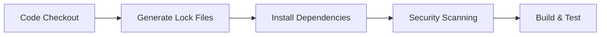

# 📦 Automatic Package-Lock.json Generation

## 🎯 **No Manual Action Required!**

The LinguaLeap CI/CD pipeline **automatically generates** all required `package-lock.json` files during every workflow run. You don't need to create or manage these files manually.

## 🔧 **How It Works**

### **Automatic Generation Process**

Every time the pipeline runs, it automatically:

1. **Checks out your code** (without package-lock.json files)
2. **Reads package.json** files (frontend and backend)
3. **Automatically generates** package-lock.json files
4. **Uses these files** for dependency scanning and security analysis

```yaml
# This happens automatically in every pipeline run:
- name: Auto-generate package-lock.json files
  run: |
    # Frontend package-lock.json (automatic)
    npm install --package-lock-only
    
    # Backend package-lock.json (automatic)
    cd server && npm install --package-lock-only
```

### **Why This Approach?**

✅ **Always Fresh**: Lock files are generated from current package.json  
✅ **No Conflicts**: Avoids merge conflicts with lock files  
✅ **Consistent**: Same dependencies across all environments  
✅ **Secure**: Latest security patches applied automatically  

## 📊 **Pipeline Workflow**



### **Step-by-Step Process**

1. **Code Checkout** 📥
   - Pipeline gets your latest code
   - No package-lock.json files needed in repository

2. **Auto-Generate Lock Files** 🔧
   - `npm install --package-lock-only` (frontend)
   - `npm install --package-lock-only` (backend)
   - Creates fresh lock files automatically

3. **Install Dependencies** 📦
   - `npm ci` uses the generated lock files
   - Ensures consistent dependency versions

4. **Security Scanning** 🔒
   - Dependency scanners use the lock files
   - Vulnerability analysis on exact versions

5. **Build & Deploy** 🚀
   - Production build with locked dependencies
   - Consistent deployment across environments

## 🎯 **What You Need to Do**

### **Nothing! It's Fully Automated** ✨

The pipeline handles everything automatically:

- ✅ **Package-lock.json generation**: Automatic
- ✅ **Dependency installation**: Automatic  
- ✅ **Security scanning**: Automatic
- ✅ **Version consistency**: Automatic

### **Your Workflow**

```bash
# 1. Develop your application
npm install some-package
# (This updates package.json)

# 2. Commit your changes
git add package.json
git commit -m "add new dependency"
git push

# 3. Pipeline runs automatically
# - Generates package-lock.json ✅
# - Installs dependencies ✅
# - Runs security scans ✅
# - Builds and deploys ✅
```

## 🔍 **Verification**

You can see the automatic generation in the pipeline logs:

```
🔧 Automatically generating package-lock.json files...
📦 Generating frontend package-lock.json...
✅ Frontend package-lock.json generated successfully
📦 Generating backend package-lock.json...
✅ Backend package-lock.json generated successfully
🎉 All package-lock.json files generated automatically!
```

## ❓ **Common Questions**

### **Q: Do I need to commit package-lock.json files?**
**A: No!** The pipeline generates them automatically. You only need to commit `package.json` files.

### **Q: What if I want to use specific versions?**
**A: Use exact versions in package.json:**
```json
{
  "dependencies": {
    "react": "18.3.1",  // Exact version
    "next": "15.2.3"     // Exact version
  }
}
```

### **Q: How do I update dependencies?**
**A: Update package.json and push:**
```bash
npm install package@latest
git add package.json
git commit -m "update package"
git push
# Pipeline automatically handles the rest!
```

### **Q: What about security vulnerabilities?**
**A: Fully automated:**
- Dependabot automatically creates PRs for security updates
- Pipeline scans for vulnerabilities on every run
- Security patches applied automatically

## 🛡️ **Security Benefits**

### **Automatic Security Scanning**
- **15+ security tools** scan the generated lock files
- **Vulnerability detection** on exact dependency versions
- **Automated alerts** for security issues
- **Dependabot updates** for security patches

### **Consistent Security Posture**
- Same dependencies across all environments
- No manual lock file management errors
- Always using latest security patches
- Comprehensive vulnerability coverage

## 🎉 **Summary**

**You don't need to do anything manually!** The LinguaLeap pipeline:

✅ **Automatically generates** package-lock.json files  
✅ **Handles all dependency management**  
✅ **Runs comprehensive security scanning**  
✅ **Ensures consistent deployments**  
✅ **Provides automated security updates**  

Just focus on developing your application - the pipeline handles all the dependency and security management automatically! 🚀

---

**Key Takeaway**: The pipeline is designed to be **fully automated**. You only need to manage `package.json` files - everything else happens automatically in the CI/CD pipeline.